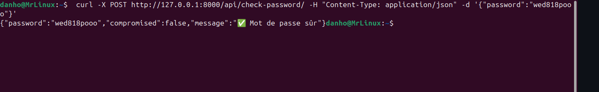

**passVerificator** est une API permettant de vérifier si un mot de passe a été compromis en le comparant à la liste de mots de passe divulgués comme  rockyou.txt

## Installation

1. Clonez le dépôt :
   ```bash
   git clone <url-du-repo>
   cd passVerificator
   ```

2. Installez les dépendances Python :
   ```bash
   pip install -r requirements.txt
   ```


## Utilisation

Lancez le serveur Django :
```bash
python manage.py runserver
```

### Vérification d’un mot de passe

Envoyez une requête POST à l’endpoint `/api/check-password/` avec le mot de passe à vérifier :

```json
{
  "password": "votre_mot_de_passe"
}
```

Réponse possible :
```json
{
  "password": "votre_mot_de_passe",
  "compromised": true,
  "message": "⚠️ Mot de passe compromis !"
}
```

## Structure du projet

- `api/views.py` : Vue principale de l’API.
- `api/bloom_loader.py` : Chargement du filtre de Bloom(compromised.bloom ),qui contient les mots de passe stockés en binaire.
- `api/serializers.py` : Validation des données d’entrée.

---

## English


**passVerificator** is an API that checks if a password has been compromised by comparing it to leaked password lists such as rockyou.txt.

## Installation

1. Clone the repository:
   ```bash
   git clone <repo-url>
   cd passVerificator
   ```

2. Install Python dependencies:
   ```bash
   pip install -r requirements.txt
   ```

## Usage

Start the Django server:
```bash
python manage.py runserver
```

### Password check

Send a POST request to the `/api/check-password/` endpoint with the password to check:

```json
{
  "password": "your_password"
}
```

Example response:
```json
{
  "password": "your_password",
  "compromised": true,
  "message": "⚠️ Compromised password!"
}
```

## Project structure

- `api/views.py`: Main API view.
- `api/bloom_loader.py`: Loads the Bloom filter (`compromised.bloom`), which contains passwords stored in binary format.
- `api/serializers.py`: Input data validation.

## License

This project is open-source. See the LICENSE file for more information.


